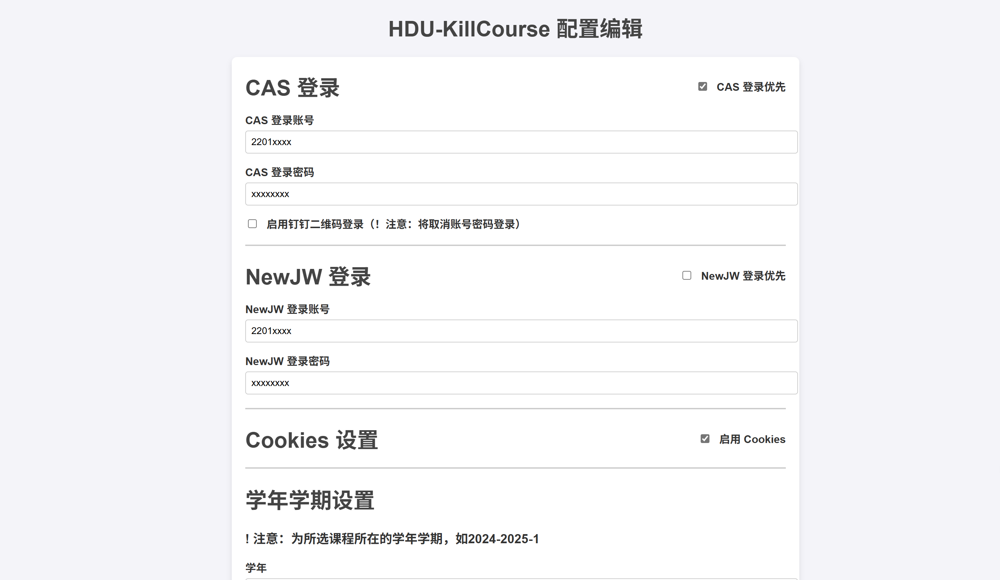

# HDU-KillCourse

>本项目仅供学习和研究使用请于24小时内删除。使用本项目所产生的任何后果由使用者自行承担。在使用本项目之前，请确保您已充分了解相关法律法规，并确保您的行为符合所在国家或地区的法律要求。未经授权的情况下，请勿将本项目用于商业用途或其他非法用途。转载使用请标明出处。

- 

`杭电 抢课×选课√`

## 简介

- 支持主修，选修，体育课程，特殊课程
- 支持蹲课

> [!TIP]
>
> If you are good at using it, you'll discover some pleasant surprises.

## 环境

Go 1.23

## 使用

1. 下载编译文件

- 在 [Releases](https://github.com/cr4n5/HDU-KillCourse/releases)中，下载对应系统的可执行文件。

- Or

```shell
go build
```

2. 修改配置

`Web编辑配置`

- click 可执行文件
- 访问 http://localhost:6688 (默认端口) ，即可进入配置页面。



`手动编辑配置`

- 下载 [config.example.json](./config.example.json) 文件。
- 进入 [config.example.json](./config.example.json) 文件，修改对应内容。
- 配置名更改为 config.json。

```
{
    "cas_login": {
        "username": "2201xxxx",//杭电统一身份认证账号密码
        "password": "xxxxxxxx",
        "dingDingQrLoginEnabled": "0",//置1使用钉钉扫码登录   默认使用账号密码登录
        "level:" : "0" //优先级
    },
    "newjw_login": {
        "username": "2201xxxx",//正方教务系统账号密码
        "password": "xxxxxxxx",
        "level:" : "1" //优先级
    }, // 0<1 所以优先使用cas登录 所以0比1大 数学天才
    "cookies": { //若 JSESSIONID为空 或 route为空 或 enabled为0，则将不会使用cookies登录
        "JSESSIONID": "",// 每次登录cookie参数都会自动更新
        "route": "",
        "enabled": "1"//如若登录过期，程序重启大法
    },
    "time": {
        "XueNian": "2024",//所选课程所在的学年学期，如2024-2025-1
        "XueQi": "1"
    },
    //课程教学班名称，如(2024-2025-1)-C2092011-01
    //课程按顺序执行
    "course" : {
        "(2024-2025-1)-C2092011-01" : "1",//1为选课，0为退课
        "(2024-2025-1)-T1300019-04" : "1",
        "(2024-2025-1)-T1300019-05" : "1",
        "(2024-2025-1)-B2700380-02" : "0",
        "(2024-2025-1)-C2892008-02" : "1",
        "(2024-2025-1)-W0001321-06" : "0"
    },
    "wait_course": {
        "interval": 60, //查询课程间隔时间，单位秒
        "enabled": "0" //是否开启蹲课，开启后将蹲course中值为1的课程，不再进行抢课
    }, 
    "smtp_email": { //邮件通知，开启后将会在蹲选课成功后发送邮件通知
        "host": "smtp.qq.com", //smtp服务器
        "username": "...@qq.com", //发送邮件的邮箱
        "password": "xxxxxxxx", //发送邮件的邮箱授权码
        "to": "...@qq.com", //接收邮件的邮箱
        "enabled": "0" //是否开启邮件通知
    },
    "start_time": "2024-07-25 12:00:00",//程序开始时间
}
```

3. 选课

- 选课之前，<a href='https://github.com/cr4n5/HDU-course_list'>任务落实课程导出（已合并在此项目中）</a>，排好课表，获取课程教学班名称

> [!NOTE]
>
> 需在任务落实查询开放后，并在选课之前（省去在选课时查询课程请求）执行一次可执行文件获取课程信息

> [!CAUTION]
>
> 执行期间请勿在他处登录教务系统，如要登录，请将浏览器与配置Cookies同步

- 保证可执行文件和config.json在同一级目录下，然后在开始前几分钟执行可执行文件即可

## 协议

[Apache License 2.0](./LICENSE)
